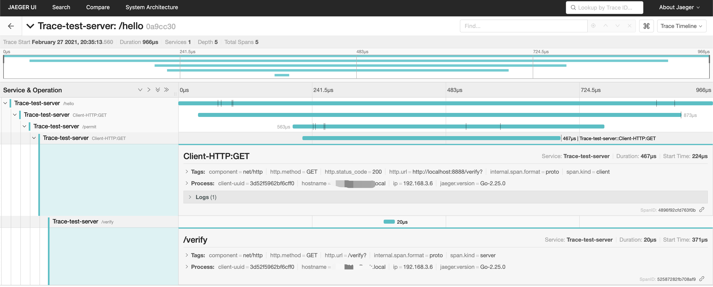

# go-trace

#### 介绍
golang opentracing 结合gin框架的链路追踪demo

#### 软件架构
基于gin+opentracing-go+jaeger(兼容Zipkin)实现微服务下的链路追踪

golang > 1.10


#### 安装教程

1. 代码拉取和初始化

   ```sh
   git clone https://gitee.com/macohong/go-trace.git
   cd go-trace
   go mod tidy
   # start web server
   go run main.go
   # 访问http://localhost:8888/hello
   ```

2. 使用docker拉取最新的jaeger，执行以下命令启动jaeger

   ```shell
   docker pull jaegertracing/all-in-one
   # run docker
   docker run -d -e COLLECTOR_ZIPKIN_HTTP_PORT=9411 -p 5775:5775/udp -p 6831:6831/udp -p 6832:6832/udp -p 5778:5778 -p 16686:16686 -p 14268:14268 -p 14269:14269  -p 9411:9411 jaegertracing/all-in-one:latest
   # 访问http://127.0.0.1:16686即可看到结果如下图(先发起/hello请求)
   ```

   

#### 使用说明

1. 创建一个jaeger tracer并设置全局的tracer

   ```go
   // go-trace/trace/trace.go
   type Config struct {
   	ServiceName        string 			 // 服务名
   	OpenReporter       bool					 // 是否上报到追踪系统
   	Stdlog             bool					 // 控制台是否打印日志
     ReportHost         string        // 上报的主机地址 例如: 127.0.0.1:9941
     SamplerType        string        //const全量采集(0,1), probabilistic概率采集(0~1), rateLimiting限速采集(>0), or remote动态采集(0~1)
   	SamplerParam       float64       // 根据SmaplerType类型不同设置不一样，详细请参考jaeger文档
   	FlushInterval      time.Duration // 定时上报缓存数据 单位秒
   	DisableClientTrace bool					 // 是否开启客户端采集
   }
   func NewTracer(c *Config) (opentracing.Tracer, io.Closer) {
   	cfg := &config.Configuration{
   		ServiceName: c.ServiceName,
   		Sampler: &config.SamplerConfig{
   			Type:  c.SamplerType,
   			Param: c.SamplerParam,
   		},
   		Reporter: &config.ReporterConfig{
   			LocalAgentHostPort:  c.ReportHost,
   			BufferFlushInterval: time.Duration(c.FlushInterval),
   			LogSpans:            c.OpenReporter,
   		},
   	}
   	// coding...
     // jaeger可以随意替换其它库
     tracer, closer, err := cfg.NewTracer(opts...)
   	SetGlobalTracer(tracer)
   	DisableClientTrace = c.DisableClientTrace
   	return tracer, closer
   }
   ```

   

2. 开始一个span，并返回span的spanContext

   ```go
   // go-trace/http/trace.go
   // Trace is trace middleware
   func Trace() gin.HandlerFunc {
   	return func(c *gin.Context) {
   		cx := NewContext(c)
   		var t trace.Tracer
       // 从请求里面查找是否有trace，如果没有则启动一个parent的span
   		spanCtx, err := trace.Extract(opentracing.HTTPHeaders, opentracing.HTTPHeadersCarrier(c.Request.Header))
   		if err != nil {
   			t = trace.StartSpan(c.Request.URL.Path)
   		} else {
   			t = trace.StartSpan(c.Request.URL.Path, ext.RPCServerOption(spanCtx))
   		}
   		// t.SetTag...
       // 返回span的spanContext
   		reqCtx := opentracing.ContextWithSpan(cx, t.GetSpan())
       // 是否启用clientTrace
   		if !trace.DisableClientTrace {
   			clientTrace := Tracer{t}
   			reqCtx = httptrace.WithClientTrace(reqCtx, clientTrace.ClientTrace())
   		}
   		// 设置Requst上下文，Client的上下文使用了Request上下文
   		cx.Request = cx.Request.WithContext(reqCtx)
   		cx.Next()
   		t.Finish(nil)
   	}
   }
   ```

   

3. 生成子span

   ```go
   // go-trace/http/trace.go
   // RoundTrip ...
   func (t *TraceTransport) RoundTrip(req *http.Request) (*http.Response, error) {
   	// coding...
     // 客户端Client开启一个子的span,如果没有则创建一个parent span后再创建一个子span
   	tr, parentCtx := trace.StartSpanFromContext(req.Context(), fmt.Sprintf("Client-HTTP:%s", req.Method))
   	if parentCtx == nil {
   		return rt.RoundTrip(req)
   	}
   	// tr.SetTag...
   	// inject trace to http header
   	tr.Inject(opentracing.HTTPHeaders, opentracing.HTTPHeadersCarrier(req.Header))
   	// coding...
   }
   ```

   

4. 调用客户端代码

```go
// go-trace/main.go
var (
	client  *http.Client
	baseURL = "http://localhost:8888"
)
// coding...
func hello(c *http.Context) {
	var res resp
  // client.Get传入的context不能是gin.Context
	if err := client.Get(c.Request.Context(), baseURL+"/permit", nil, res); err == nil {
		log.Infof("hello request permit, resp:%s", res.Data)
	}
	c.Jsonify("hello")
}

func permit(c *http.Context) {
	var res resp
	if err := client.Get(c.Request.Context(), baseURL+"/verify", nil, res); err == nil {
		log.Infof("hello request verify, resp:%s", res.Data)
	}
	c.Jsonify("permit")
}

func verify(c *http.Context) {
	c.Jsonify("verify")
}

// 请求http://localhost:8888/hello服务器响应以下日志
// 2021/02/27 20:35:13 Reporting span 0a9cc3026e52249d:52587282fb708af9:4896f92cfd763f0b:1
// [20210227 20:35:13] 200 GET /verify HTTP/1.1 (::1) 82.635µs 
// 2021/02/27 20:35:13 Reporting span 0a9cc3026e52249d:4896f92cfd763f0b:048629f89ffbcba3:1
// INFO[0014] hello request verify, resp:verify            
// 2021/02/27 20:35:13 Reporting span 0a9cc3026e52249d:048629f89ffbcba3:5df237a3658986e1:1
// [20210227 20:35:13] 200 GET /permit HTTP/1.1 (::1) 585.927µs 
// 2021/02/27 20:35:13 Reporting span 0a9cc3026e52249d:5df237a3658986e1:0a9cc3026e52249d:1
// INFO[0014] hello request permit, resp:permit            
// 2021/02/27 20:35:13 Reporting span 0a9cc3026e52249d:0a9cc3026e52249d:0000000000000000:1
// [20210227 20:35:13] 200 GET /hello HTTP/1.1 (::1) 990.624µs
```

#### License

go-trace项目使用MIT license

